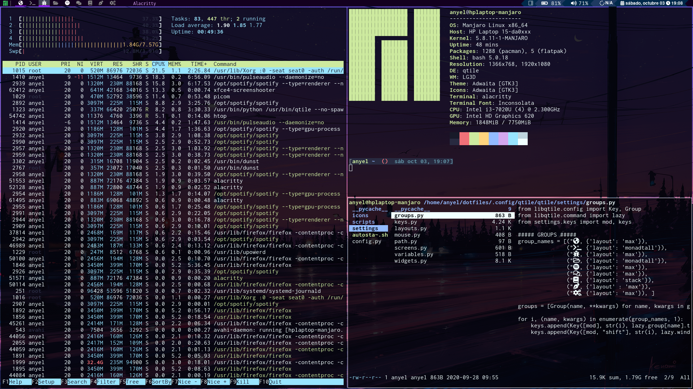

# Qtile

# Software list
List of required programs for general config: 
...nautilus
...libreoffice
...spotify
...alacritty
...discord
...virtualbox
...firefox
...python-pip
...neofetch
...feh
...otf-font-awesome
...rm-connection-editor
...blueman-adapters	
...picom
...dmenu
...scrot
...neofetch 
...neovim 
...vscode
...qtile
...some nerd-fonts
...rofi
...redshift
...Ranger
...xmenu	

